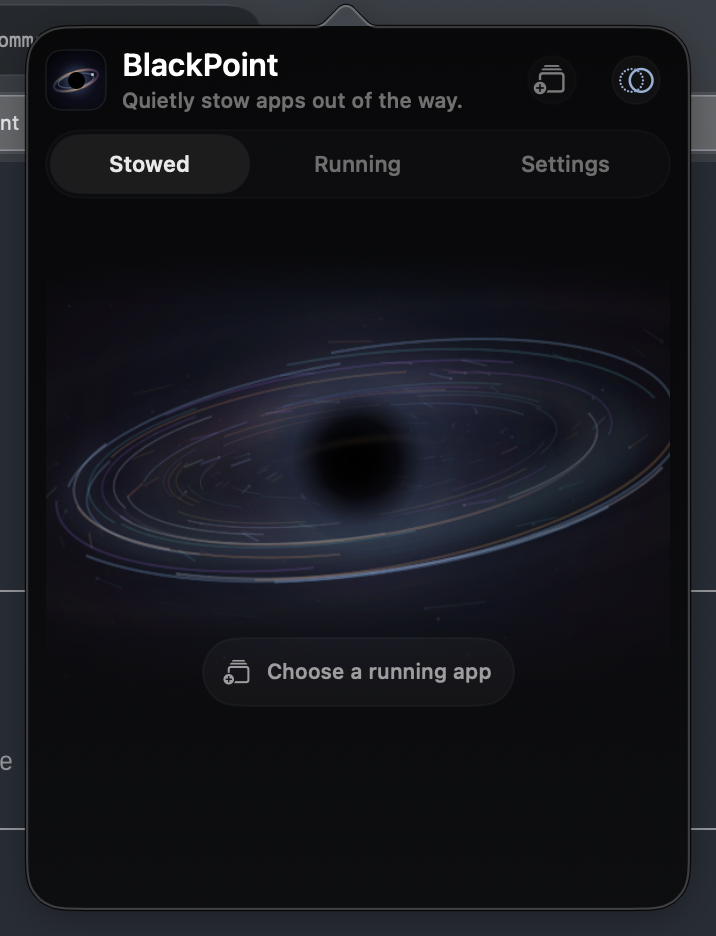
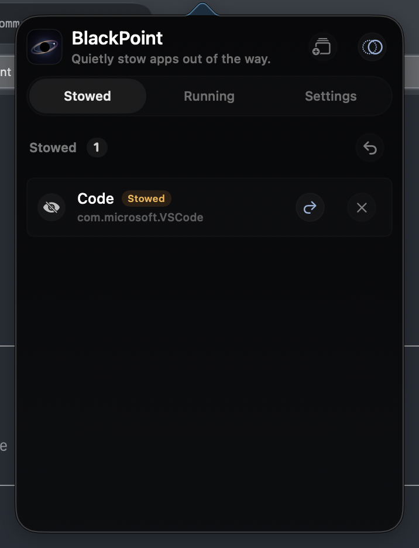

# BlackPoint

**English** · [简体中文](README.zh-CN.md)

[](https://github.com/7757/BlackPoint/releases/latest)
[](https://github.com/7757/BlackPoint/releases)
[](LICENSE)

BlackPoint is a compact macOS menu bar utility for stowing distracting apps without quitting them.

It hides selected apps, keeps them out of the normal switching flow, and restores them when you need them again.

## Preview

<p>
  
  
</p>

## Install

```sh
curl -fsSL https://7757.github.io/BlackPoint/install.sh | bash
```

You can also download the latest zip from [GitHub Releases](https://github.com/7757/BlackPoint/releases/latest).

## Features

- Stow the current frontmost app with a global shortcut.
- Stow other running apps while keeping the current app visible.
- Keep stowed apps hidden if they are activated again.
- Optionally skip stowed apps while switching with `Command + Tab`.
- Configure global shortcuts for every action.
- Launch at login through Apple's `SMAppService`.
- Use the app and website in English or Simplified Chinese.

## Shortcuts

| Action | Default shortcut |
| --- | --- |
| Stow current app | `Control + Option + Command + B` |
| Stow other apps | `Control + Option + Command + A` |
| Open BlackPoint | `Control + Option + Command + Space` |
| Switch to next visible app | `Command + Tab` |
| Switch to previous visible app | `Shift + Command + Tab` |

## macOS Limitation

macOS does not allow one normal app to permanently convert another app into a background agent while preserving its state. BlackPoint therefore uses public APIs to hide windows, keep selected apps hidden, and optionally filter app switching while it is running.

## Build

```sh
swift build -c release
Scripts/package-app.sh
open build/BlackPoint.app
```

For distribution, sign with a stable Developer ID identity and notarize the result:

```sh
CODESIGN_IDENTITY="Developer ID Application: Your Team" Scripts/package-app.sh
```

## Release

See [RELEASE.md](RELEASE.md).

## License

MIT. See [LICENSE](LICENSE).
